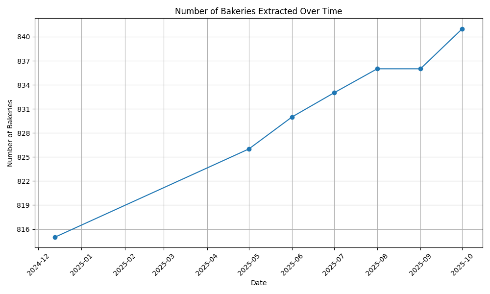

# Marie-Blachère 🥖

**Data last updated on: 2025-04-01**

Data extracted from: [Marie Blachère](https://boulangeries.marieblachere.com/)

## 📅 Use the Latest Data Scraped Each Month

Simply use the latest version of the data:
- [marie_blachere.geojson](marie_blachere.geojson) contains GeoJSON features.
- [challenge.geojson](challenge.geojson) can be used to create a challenge on [MapRoulette](https://maproulette.org/).

## 🛠️ Or Run the Scripts for the Latest Data

### 📋 Prerequisites
- Python 3.x
- Python libraries: `pip install -r requirements.txt`
- Node.js
- MapRoulette CLI: `npm install -g @maproulette/mr-cli`

### 🔧 Steps
1. Run the Python script `marie_blachere.py`.
2. Wait until the files `marie_blachere.geojson` and `marie_blachere.osm` are created.
3. Run `mr coop change --out challenge.geojson ./marie_blachere.osm`.
4. Use `challenge.geojson` to create a challenge on [MapRoulette](https://maproulette.org/).
